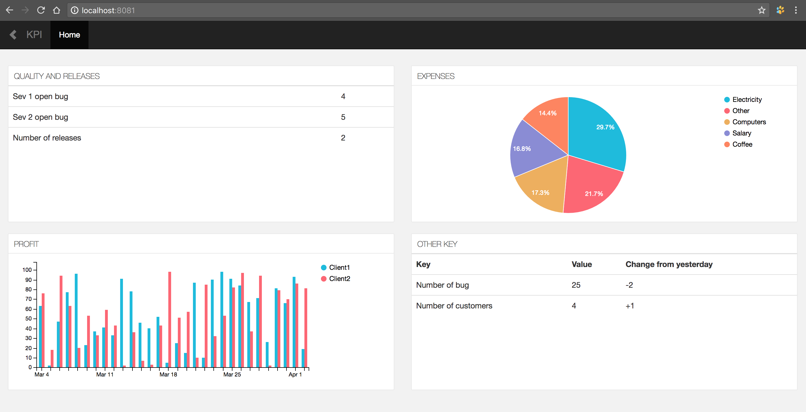
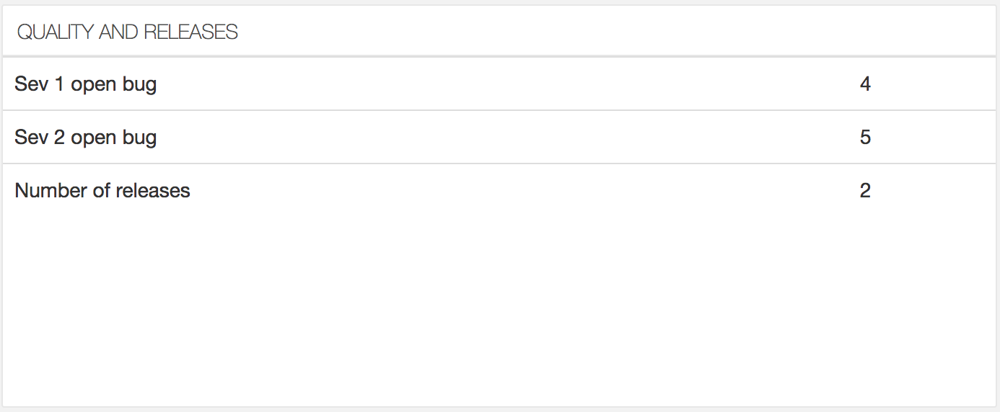
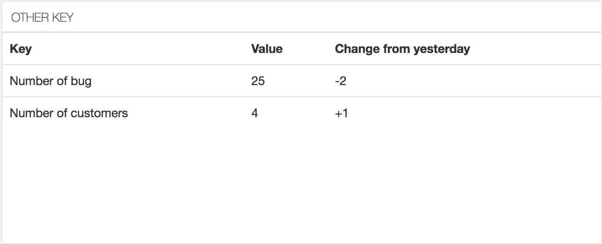
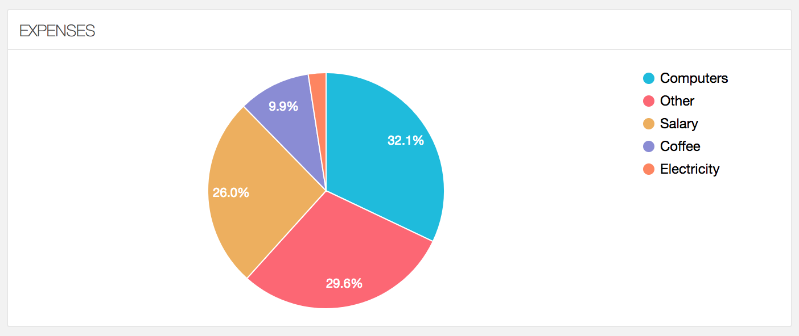

This is KPI readme.
KPI is app which shows different Key Performance Indicator data on one screen.


# Frontend
Here I describe how to manage front end content. Let's start with table view:
##Table without header



The data for it is requested from backend `/api/v1/quality-and-releases` in `static/public/js/index.js` file: 
```js
$.ajax({
          type: "GET",
          url: "/api/v1/quality-and-releases",
          success: function(data) {
              showTable(data, $qualityAndReleases);
          },
          dataType: "json",
      });
```
The response is the following:
```json
{
  "Name": "Quality and Releases",
  "Header": null,
  "Data": [
    [
      "Sev 1 open bug",
      "4"
    ],
    [
      "Sev 2 open bug",
      "5"
    ],
    [
      "Number of releases",
      "2"
    ]
  ]
}
```
`showTable` function uses this response data to render the table with Title `Quality and Releases`. Its second parameter
is selector `$qualityAndReleases` - the container where to build the table. In this case it's:
```js
var $qualityAndReleases = $("#quality-and-releases");
```
##Table with header
In similar way we render table with header:


We are requesting backend `/api/v1/other-key` and the response looks like this:
```json
{
  "Name": "Other key",
  "Header": [
    "Key",
    "Value",
    "Change from yesterday"
  ],
  "Data": [
    [
      "Number of bug",
      "25",
      "-2"
    ],
    [
      "Number of customers",
      "4",
      "+1"
    ]
  ]
}
```
The response data has `Header` array:
```json
"Header": [
    "Key",
    "Value",
    "Change from yesterday"
  ]
```
This is why `showTable` function rendered this data as a table with header line.

## Pie chart


Pie is rendered using [keen](https://github.com/keen/dashboards) library.
If we look in file `static/public/js/index.js` we see the following:
- When keen is ready:
```
Keen.ready(function(){
    // do all job here
 });

```
2. Prepare the place for pie:
```
  // Expenses (pie)
  var expenses_pie = new Keen.Dataviz()
    .el('#pie-chart') // the chart will be rendered inside element with id '#pie-chart'
    .type('pie') // the chart is type of pie (other types: bar, area)
    .height(window.Common.Height) // set height of the chart 
    .title('Expenses') // title of the chart
    .prepare(); 
```
No you can see spinner inside the html element #pie-chart.
3. Requesting the data: it's just ajax request to the backend server:
```js
        $.ajax({
            type: "GET",
            url: "/api/v1/expenses",
            success: function(data) {
                expenses_pie
                    .data(data)
                    .sortGroups('desc')
                    .render();
            },
            dataType: "json",
            error: function(e) {
                expenses_pie.message("Could not request expenses data");
            }
        });
```
We get the following response:
```json
[
  {
    "kind": "Electricity",
    "result": 671
  },
  {
    "kind": "Salary",
    "result": 7208
  },
  {
    "kind": "Other",
    "result": 8198
  },
  {
    "kind": "Coffee",
    "result": 2734
  },
  {
    "kind": "Computers",
    "result": 8879
  }
]

```
4. Now render this data in the prepared [keen](https://github.com/keen/dashboards) chart:

```js
expenses_pie
    .data(data)
    .sortGroups('desc')
    .render();
```
And if we have error response we can render error message inside our chart:
```js
expenses_pie.message("Could not request expenses data");
```
## Bar chart
Bar chart is rendered in similar way. Just a few differences:
1. Prepare the chart of type `bar` inside div with id `bar-chart`
```js
var profit = new Keen.Dataviz()
    .el('#bar-chart')
    .type('bar') 
    .height(window.Common.Height)
    .stacked(false) // if use true bars are displayed on top of each other rather than near by
    .title('Profit')
    .prepare();
```


1. Requesting the backend:
```js
$.ajax({
          type: "POST",
          url: "/api/v1/profit",
          data: JSON.stringify({Directive: "list", Params:[start, end]}),
          success: function(data) {
              profit
                  .data(data)
                  .sortGroups('desc')
                  .render();
          },
          dataType: "json",
          error: function(e) {
              profit.message("Could not request expenses data");
          }
      });
```
The response contains timeframe data as well as values:
```json
{
  "result": [
    {
      "value": [
        {
          "name": "Client1",
          "result": 54
        },
        {
          "name": "Client2",
          "result": 21
        }
      ],
      "timeframe": {
        "start": "2018-03-04T03:53:18Z",
        "end": "2018-03-04T03:53:18Z"
      }
    },
    {
      "value": [
        {
          "name": "Client1",
          "result": 87
        },
        {
          "name": "Client2",
          "result": 26
        }
      ],
      "timeframe": {
        "start": "2018-03-05T03:53:18Z",
        "end": "2018-03-05T03:53:18Z"
      }
    }, // removed some data from the array to shorten the JSON for readme
    {
      "value": [
        {
          "name": "Client1",
          "result": 16
        },
        {
          "name": "Client2",
          "result": 19
        }
      ],
      "timeframe": {
        "start": "2018-04-02T03:53:18Z",
        "end": "2018-04-02T03:53:18Z"
      }
    }
  ]
}
```

## Html
Main html file `static/content/index.html` looks like this:
```
{{define "index"}}
    {{template "header" .}}
    <div class="row">

      <div class="col-sm-6">
        <div id="quality-and-releases" class="tile keen-dataviz"></div>
        <br>
      </div>

      <div class="col-sm-6">
        <div id="pie-chart"></div>
        <br>
      </div>

    </div>

    <div class="row">

        <div class="col-sm-6">
            <div id="bar-chart"></div>
            <br>
        </div>

        <div class="col-sm-6">
            <div id="other-key" class="tile keen-dataviz"></div>
            <br>
        </div>

    </div>
    <script type="text/javascript" src="/public/js/index.js"></script>

    {{template "footer" .}}
{{end}}
```

It attaches templates for showing header and footer:
```
{{template "header" .}}
// main contnent
{{template "footer" .}}
```

Main content is a bunch of rows:
```
    <div class="row">

      <div class="col-sm-6">
        <div id="quality-and-releases" class="tile keen-dataviz"></div>
      </div>

      <div class="col-sm-6">
        <div id="pie-chart"></div>
      </div>

    </div>
```

Javascript is just rendering charts and tables to elements with specified ids, like `quality-and-releases` and `pie-chart`.  

# Backend
Golang is used to serve the frontend. I have simple `run.sh` file for rebuilding and launching the backend server:
```go
./run.sh
```
```
+(./run.sh:3):  myMac REPO=/Users/maks/Dropbox/golang/src/bitbucket.org/maxim_yefremov/kpi_dashboard
+(./run.sh:4):  myMac cd /Users/maks/Dropbox/golang/src/bitbucket.org/maxim_yefremov/kpi_dashboard/apps/kpi_dashboard
+(./run.sh:5):  myMac go install
+(./run.sh:6):  myMac cd /Users/maks/Dropbox/golang/src/bitbucket.org/maxim_yefremov/kpi_dashboard
+(./run.sh:7):  myMac kpi_dashboard -alsologtostderr
I0404 07:50:42.188197   23916 util.go:125] working directory /Users/maks/Dropbox/golang/src/bitbucket.org/maxim_yefremov/kpi_dashboard
I0404 07:50:42.190424   23916 server.go:88] listening 0.0.0.0:8081
```
The API functions which are called by frontend js are configured in file server.go:
```golang
func initCmds(context *Context) {
	apiFuncs = map[string]*apiFunc{
		"expenses":             {Handler: expensesHandler, Context: context},
		"profit":               {Handler: profitHandler, Context: context},
		"quality-and-releases": {Handler: qualityAndReleasesHandler, Context: context},
		"other-key":            {Handler: otherKeyHandler, Context: context},
	}
}
```